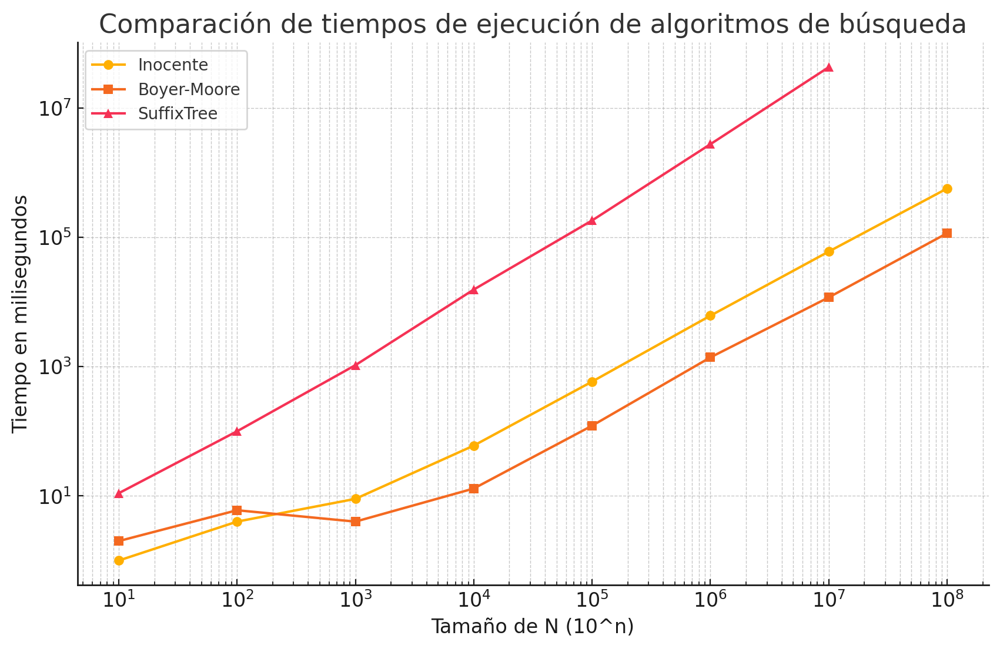

# Alumno: Ildefonso Santos Steve Andy

# String Matching

> Implementar y experimentar con los algoritmos para String Matching vistos en clase.
> Muestre la tabla comparativa con los tiempos en milisegundos y adjunte un gráfico.

## Tabla comparativa

| N    | Inocente | BoyerMoore | SuffixTree      |
| ---- | -------- | ---------- | --------------- |
| 10^1 | 1        | 2          | 11              |
| 10^2 | 4        | 6          | 100             |
| 10^3 | 9        | 4          | 1054            |
| 10^4 | 60       | 13         | 15573           |
| 10^5 | 587      | 122        | 182668          |
| 10^6 | 6145     | 1391       | 2767607         |
| 10^7 | 60346    | 11795      | 42979672        |
| 10^8 | 570432   | 115947     | (pc explotó :c) |

## Gráfico

Grafico guardado localmente en `graphic.png` que muestra los tiempos de ejecución de cada algoritmo para diferentes tamaños de entrada.

